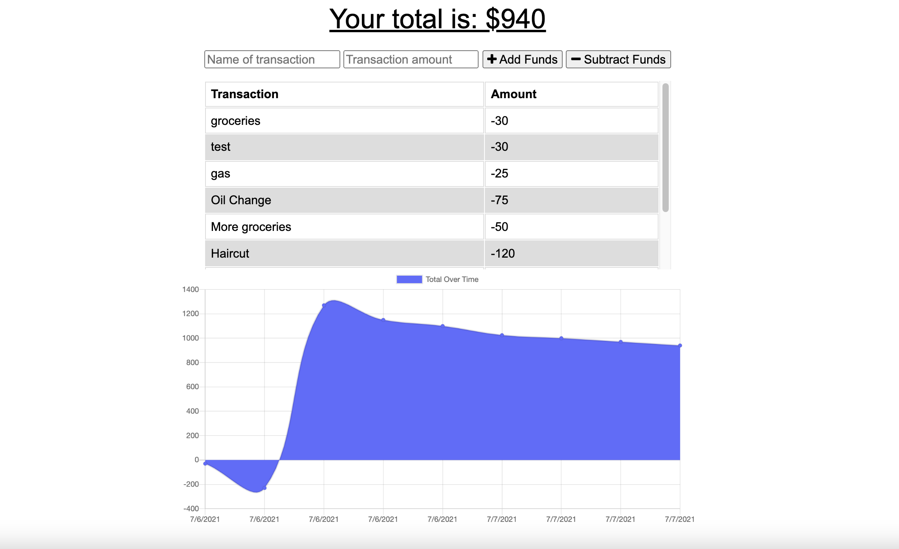

# Budget Tracker

## Description
As an avid traveller I want to be able to track my withdrawals and deposits with or without a data/internet connection so that my account balance is accurate when I am traveling.
## Table of Contents
- [Installation](#installation)
- [Usage](#usage)
- [License](#license)
- [Contributing](#contributing)
- [Questions](#questions)
## Installation
To install necessary dependencies, run the following command:
```
npm i
npm start
```

## Usage
Compression, Express, Mongoose, Lite-Server, and Morgan are all required to run this application.

A linked to my deployed page can be found here: [Heroku](https://still-thicket-10545.herokuapp.com/).




## License
This project is licensed under the: none.


## Contributing
There were no additional contributors to this project.

## Questions
If you have any questions about the repo, open an issue or contact me directly at boppcaitlin@gmail.com. You can find more of my work at [caitbopp](https://github.com/caitbopp).